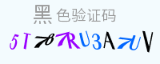

验证码组件
=============
安全可靠的验证码，拥有强大的反机器识别能力，同时又不失人眼阅读体验。

## require
 - php 5.5+
 - GD2

## 使用示例
```
//useage:
// 生成验证码
$capt = new \wf\captcha\strategy\GDSimple();
$secId = 'login';
$capt->render($secId);

// 验证码对比校验
if (!\wf\captcha\Code::check(@$_POST['secode'], 'login')) {
     print 'error secode';
}
```

## 效果预览

- 普通效果 


- 高级效果 




## 配置选项

```
// 可设置配置项及默认值
$cfg = [
    'expire'    => 3000,   // 验证码过期时间（s）
    'useBgImg'  => false,  // 是否使用背景图片 
    'useCurve'  => false,  // 是否画混淆曲线
    'useNoise'  => true,  // 是否添加杂点    
    'gradient'  => 22,     // 文字倾斜度范围
    'fontSize'  => 16,     // 验证码字体大小(px)
    'height'    => 0,      // 验证码图片高，0为根据fontSize自动计算
    'width'     => 0,      // 验证码图片宽，0为根据fontSize自动计算
    'length'    => 4,      // 验证码位数

    // 验证码背景颜色
    'bg'        => [243, 251, 254], 

    // 验证码选择使用的字体列表，字体放在 ./assets/ttfs/ 文件夹
    'ttfs'      => ['1.ttf'],  

    // 验证码选择使用的背景图片列表，图片放在 ./assets/bgs/ 文件夹
    'bgs'       => ['1.jpg', '2.jpg', '3.jpg', '4.jpg', '5.jpg', '6.jpg', '7.jpg', '8.jpg'], 
];
```

举个栗子：
```
$cfg = [
    'useCurve'  => true,   // 是否画混淆曲线
    'useNoise'  => false,   // 是否添加杂点    
];
$capt = new \wf\captcha\strategy\GDSimple();

// 设置参数
$capt->setCfg($cfg);

// 显示登录验证码
$capt->render('login');

```